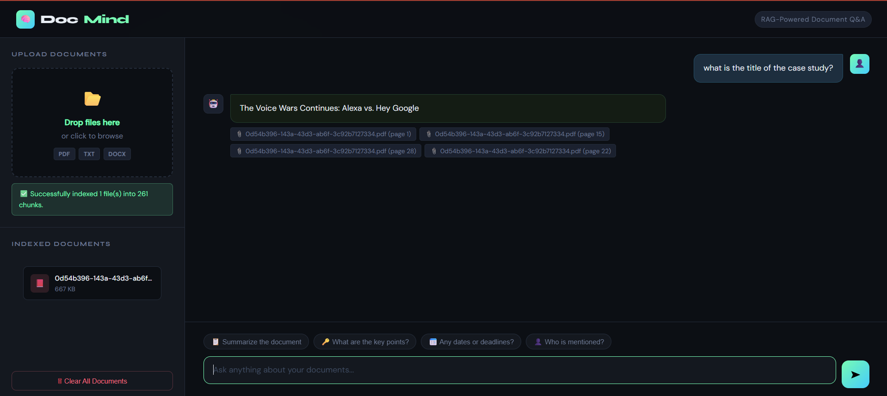
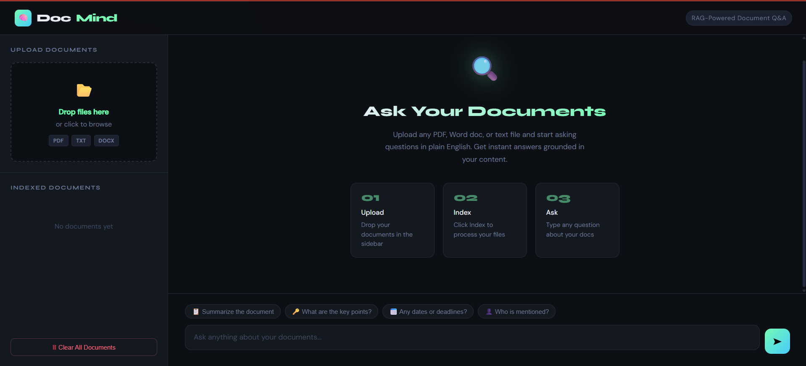
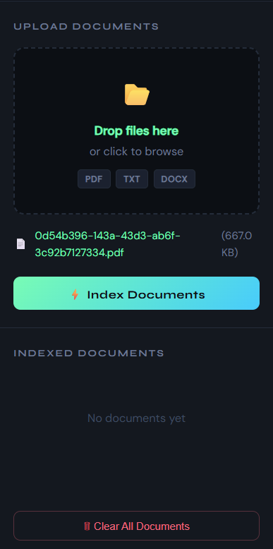
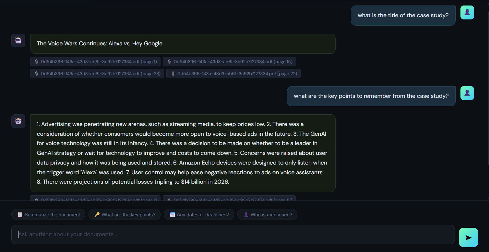

# 🧠 DocMind — AI-Powered Document Q&A

> Upload any document. Ask anything. Get instant answers grounded in your content.



---

## 📌 Overview

**DocMind** is a full-stack RAG (Retrieval-Augmented Generation) application that lets you upload private documents (PDF, DOCX, TXT) and ask questions about them in plain English — powered by OpenAI GPT and FAISS vector search.

Instead of generic AI responses, every answer is **grounded in your actual documents**, with source citations showing exactly which file and page the answer came from.

---

## 🖥️ Screenshots

### Welcome Screen


### Uploading Documents


### Asking Questions


---

## ✨ Features

- 📂 **Drag & Drop Upload** — supports PDF, DOCX, and TXT files
- ⚡ **Instant Indexing** — documents are chunked, embedded, and indexed into FAISS on upload
- 💬 **Chat Interface** — ask questions in plain English, get accurate answers
- 📎 **Source Citations** — every answer shows which document and page it came from
- 🔒 **100% Private** — your documents never leave your machine
- 🗑️ **Clear & Reset** — wipe all documents and start fresh anytime

---

## 🛠️ Tech Stack

| Layer | Technology |
|-------|-----------|
| LLM | OpenAI GPT-3.5-Turbo |
| Embeddings | OpenAI text-embedding-3-small |
| Vector Store | FAISS (Facebook AI Similarity Search) |
| RAG Framework | LangChain |
| Backend | Flask (Python) |
| Frontend | HTML, CSS, Vanilla JS |
| Document Parsing | PyPDF, python-docx |

---

## 🚀 Getting Started

### Prerequisites
- Python 3.9+
- An OpenAI API key with billing enabled ([get one here](https://platform.openai.com/api-keys))

### 1. Clone the repository

```bash
git clone https://github.com/dhrumilp7255/docmind.git
cd docmind
```

### 2. Create a virtual environment

```bash
python -m venv venv

# Windows
venv\Scripts\activate

# Mac/Linux
source venv/bin/activate
```

### 3. Install dependencies

```bash
pip install -r requirements.txt
```

### 4. Set up your API key

Create a `.env` file in the root folder:

```
OPENAI_API_KEY=your_openai_api_key_here
```

### 5. Run the app

```bash
python app.py
```

Open your browser and go to: **http://localhost:5000**

---

## 📁 Project Structure

```
docmind/
├── static/
│   └── index.html        # Frontend UI
├── app.py                # Flask backend + RAG pipeline
├── ingest.py             # CLI: index documents manually
├── query.py              # CLI: query documents from terminal
├── requirements.txt      # Python dependencies
├── .env                  # API key (not committed)
├── documents/            # Your uploaded documents
└── faiss_index/          # Generated vector index (auto-created)
```

---

## 💡 How It Works

```
Your Question
     │
     ▼
Convert to vector embedding (OpenAI)
     │
     ▼
Search FAISS index → Retrieve top-5 similar chunks
     │
     ▼
Inject chunks as context into GPT prompt
     │
     ▼
GPT generates answer grounded in your documents
     │
     ▼
Answer + Source citations returned to UI
```

1. **Ingestion** — Documents are split into 500-character overlapping chunks, embedded into vectors, and stored in a FAISS index
2. **Retrieval** — On each question, the top-5 most semantically similar chunks are retrieved
3. **Generation** — Retrieved chunks are injected into the GPT prompt as context, grounding the response in your actual content

---

## 🖥️ CLI Usage (Optional)

You can also use the terminal interface without the UI:

**Index documents:**
```bash
python ingest.py
```

**Ask questions:**
```bash
python query.py
```

---

## ⚙️ Configuration

You can tweak these settings in `app.py`:

| Setting | Default | Description |
|---------|---------|-------------|
| `chunk_size` | 500 | Characters per document chunk |
| `chunk_overlap` | 100 | Overlap between chunks |
| `TOP_K_CHUNKS` | 5 | Number of chunks retrieved per query |
| `model` | gpt-3.5-turbo | OpenAI model used for answers |

---

## 📋 Example Use Cases

- 📄 **Resume/CV** — "What are my technical skills?" or "Summarize my work experience"
- 📚 **Research Papers** — "What methodology was used?" or "What are the key findings?"
- 📑 **Legal Documents** — "What are the termination clauses?" or "What are my obligations?"
- 📊 **Reports** — "What were the Q3 results?" or "Who are the key stakeholders?"
- 📖 **Textbooks** — "Explain the concept on chapter 3" or "What are the key formulas?"

---

## ⚠️ Important Notes

- Your OpenAI API key must have **billing enabled** (minimum $5 credit)
- The `.env` file is **never committed** to GitHub — keep your key safe
- Large documents (100+ pages) may take longer to index

---

## 📄 License

MIT License — feel free to use, modify, and distribute.

---

## 🙋 Author

Built by **Dhrumil Patel**

[](https://github.com/YOUR_USERNAME)
[](https://linkedin.com/in/YOUR_USERNAME)

---

⭐ **If you found this useful, please give it a star!**
